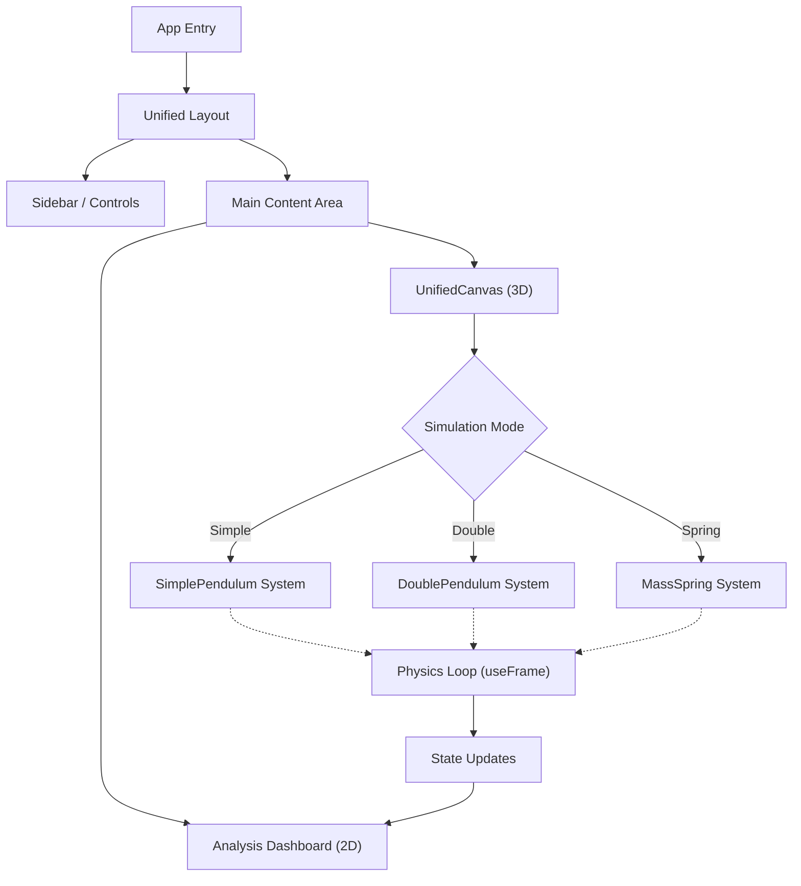

# PhySimulator: Advanced Interactive Physics Simulation Platform


## Introduction

**PhySimulator** is a comprehensive, open-source web application designed to bridge the gap between theoretical physics equations and visual intuition. By leveraging the power of **React**, **Three.js** (via @react-three/fiber), and modern web technologies, it provides a highly interactive laboratory for exploring classical mechanical systems.

Unlike traditional static diagrams or simple 2D animations, PhySimulator offers a fully immersive 3D environment where simulations run in real-time, governed by accurate numerical integration of equations of motion. It is an educational tool, a research playground for chaos theory, and a demonstration of modern web engineering capabilities.

Key highlights include:
*   **Real-time Numerical Integration**: Uses semi-implicit Euler and Verlet integration methods for stability.
*   **Interactive 3D Visualization**: fully manipulatable camera (orbit, zoom, pan).
*   **Synchronized Data Analysis**: Dual-view architecture showing the mechanical system alongside live graphs of its phase space and energy metrics.
*   **Chaos Exploration**: Specific tools designed to visualize sensitivity to initial conditions (The Butterfly Effect).

## Table of Contents

- [Introduction](#introduction)
- [Key Features](#key-features)
  - [Detailed Simulation Modules](#detailed-simulation-modules)
  - [Advanced Analysis Suite](#advanced-analysis-suite)
  - [Studio Tools](#studio-tools)
- [Technical Architecture](#technical-architecture)
  - [Core Stack](#core-stack)
  - [System Diagram](#system-diagram)
  - [Performance Optimizations](#performance-optimizations)
- [Physics Behind the Scenes](#physics-behind-the-scenes)
  - [Simple Pendulum](#simple-pendulum)
  - [Damped Driven Oscillator](#damped-driven-oscillator)
  - [Double Pendulum](#double-pendulum)
  - [Coupled Oscillators](#coupled-oscillators)
- [Numerical Integration Methods](#numerical-integration-methods)
- [Project Structure & File Map](#project-structure--file-map)
- [Component API Reference](#component-api-reference)
- [Configuration Reference](#configuration-reference)
- [Installation & Development Guide](#installation--development-guide)
- [Browser Support & Compatibility](#browser-support--compatibility)
- [Contributing Guidelines](#contributing-guidelines)
- [License](#license)
- [FAQ & Troubleshooting](#faq--troubleshooting)
## �🚀 Key Features

### Detailed Simulation Modules

#### 1. Simple Pendulum
The ideal starting point for physics students.
*   **Physics**: Approximates $T \approx 2\pi\sqrt{L/g}$ for small angles, but solves the full non-linear equation $\ddot{\theta} = -\frac{g}{L}\sin\theta$ for large amplitude accuracy.
*   **Interaction**: Drag to set initial angle, adjust length and mass in real-time.
*   **Visuals**: Shows velocity vectors and path tracing.

#### 2. Double Pendulum (Chaos Engine)
A rigorous simulation of two coupled pendulum arms.
*   **Physics**: Solves the Euler-Lagrange equations for a 2-DOF system.
*   **Chaos Mode**: Activate "Ghost Comparison" to spawn a secondary system with $\Delta\theta = 10^{-3}$ rads and watch the trajectories diverge exponentially.
*   **Energy Monitoring**: Real-time tracking of $T+V$ to verify integrator stability.

#### 3. Damped Driven Oscillator
Explore resonance and energy dissipation.
*   **Params**: Control damping coefficient ($b$), driving frequency ($\omega_d$), and driving force amplitude ($F_0$).
*   **Phenomena**: Observe transient beats, steady-state solutions, and catastrophic resonance when $\omega_d \approx \omega_0$.
*   **Phase Lag**: Visualized by the color shift of the bob as it moves in/out of phase with the driver.

#### 4. Mass-Spring System
A study in linear restoring forces.
*   **Visuals**: Procedurally generated 3D spring geometry that expands/contracts physically.
*   **Resonance**: Visual cues (color changes) when the system approaches resonant frequencies.

#### 5. Coupled Oscillators
Two masses connected by a spring, interacting with gravity.
*   **Normal Modes**: visualizes the anti-symmetric and symmetric modes of vibration.
*   **Energy Exchange**: Watch kinetic energy slosh back and forth between the two masses (beats).

### Advanced Analysis Suite
*   **Phase Space Plotter**: A dedicated canvas plotting Momentum ($p_\theta$) vs Position ($\theta$). Reveals limit cycles, strange attractors, and closed orbits.
*   **Motion Graphs**: High-performance line charts (using Recharts) updating at 60fps to show $E_{total}$, $E_{kinetic}$, $E_{potential}$.
*   **Data HUD**: Heads-up display of instantaneous values for velocity, acceleration, and forces.

### Studio Tools
*   **Cinematic Controls**: Slow motion (0.1x to 2.0x time scale), pause/scrub.
*   **Video Export**: Built-in support to record the canvas to `.webm` or `.mp4` for sharing results.
*   **Snapshots**: High-res screen capture for publications.

---

## Technical Architecture

PhySimulator follows a component-based architecture designed for modularity and performance.

### Core Stack
| Technology | Usage |
| :--- | :--- |
| **React 18** | UI Library and component state management. |
| **TypeScript** | Type safety across the entire codebase (strict mode). |
| **Vite** | Next-generation frontend tooling and build system. |
| **Three.js / R3F** | 3D Rendering engine and React reconciler. |
| **Tailwind CSS** | Utility-first styling for the UI overlay. |
| **Shadcn/UI** | Accessible, reusable UI components (based on Radix UI). |
| **Bun** | Fast JavaScript runtime and package manager. |

### System Diagram



### Performance Optimizations
Physics simulations are computationally expensive. We employ several tricks to maintain 60FPS:

1.  **Ref-based Animation Loop**: Physics calculations happen inside `useFrame`, modifying `useRef` directly instead of triggering React state updates. This avoids Re-rendering the component tree 60 times a second.
2.  **Throttled UI Updates**: State is lifted to the UI for graphing only every ~16-30ms, decoupling the visual physics (smooth) from the data graphing (throttled).
3.  **Instance Reuse**: Geometries and materials are cached and reused where possible to reduce draw calls.

---

## Physics Behind the Scenes

This project doesn't just animate arbitrary movements; it solves the real equations of motion numerically.

### Simple Pendulum
For a simple pendulum, we start with Newton's Second Law for rotation:

$$ \tau = I \alpha $$

Where torque $\tau = -mgL \sin\theta$ and moment of inertia $I = mL^2$.

$$ -mgL \sin\theta = mL^2 \frac{d^2\theta}{dt^2} $$

Simplifying gives us the governing differential equation:

$$ \frac{d^2\theta}{dt^2} = -\frac{g}{L} \sin\theta $$

In `SimplePendulum.tsx`, this is implemented as:
```typescript
const angularAcceleration = -(gravity / length) * Math.sin(currentAngleRef.current);
```

### Damped Driven Oscillator
We add two terms to the equation: a damping term proportional to velocity ($-b\dot{\theta}$) and a driving term ($F_0 \cos(\omega_d t)$).

$$ m L^2 \ddot{\theta} = -mgL \sin\theta - b L^2 \dot{\theta} + L F_0 \cos(\omega_d t) $$

Dividing by $mL^2$:

$$ \ddot{\theta} = -\frac{g}{L} \sin\theta - \frac{b}{m} \dot{\theta} + \frac{F_0}{mL} \cos(\omega_d t) $$

This allows us to simulate:
*   **Underdamping**: The system oscillates with decaying amplitude.
*   **Overdamping**: The system returns to equilibrium without oscillating.
*   **Driven Resonance**: Large amplitude oscillations when $\omega_d \approx \sqrt{g/L}$.

### Double Pendulum
For the double pendulum, Newton's laws become messy. We use Lagrangian mechanics ($\mathcal{L} = T - V$).

**Kinetic Energy ($T$):**

$$ T = \frac{1}{2}(m_1 + m_2)L_1^2 \dot{\theta}_1^2 + \frac{1}{2}m_2L_2^2 \dot{\theta}_2^2 + m_2L_1L_2\dot{\theta}_1\dot{\theta}_2 \cos(\theta_1 - \theta_2) $$

**Potential Energy ($V$):**

$$ V = -(m_1 + m_2)gL_1 \cos\theta_1 - m_2gL_2 \cos\theta_2 $$

**Equations of Motion:**
Solving $\frac{d}{dt}(\frac{\partial \mathcal{L}}{\partial \dot{\theta}_i}) - \frac{\partial \mathcal{L}}{\partial \theta_i} = 0$ yields a system of two coupled second-order differential equations.

These are solved numerically in the code (see `DoublePendulum.tsx` lines 86-96) using the **Semi-Implicit Euler Method** for performance.

```typescript
// Code snippet from DoublePendulum.tsx
const num1 = -g * (2 * m1 + m2) * Math.sin(t1);
const num2 = -m2 * g * Math.sin(t1 - 2 * t2);
const num3 = -2 * Math.sin(t1 - t2) * m2;
const num4 = w2 * w2 * L2 + w1 * w1 * L1 * Math.cos(t1 - t2);
const den = L1 * (2 * m1 + m2 - m2 * Math.cos(2 * t1 - 2 * t2));
const alpha1 = (num1 + num2 + num3 * num4) / den;
```

### Coupled Oscillators
For two pendulums coupled by a spring (constant $k$), the coupling adds a potential term $V_{spring} = \frac{1}{2}k(\Delta x)^2 \approx \frac{1}{2}kL^2(\theta_2-\theta_1)^2$.

The equations of motion become:

$$ \ddot{\theta}_1 = -\frac{g}{L}\sin\theta_1 + \frac{k}{m}(\theta_2 - \theta_1) $$
$$ \ddot{\theta}_2 = -\frac{g}{L}\sin\theta_2 - \frac{k}{m}(\theta_2 - \theta_1) $$

This linear approximation allows us to see beating phenomena where energy transfers perfectly between the two masses over time.

---

## Numerical Integration Methods

Understanding how we solve differential equations in code.

### Explicit Euler (Naive)

$$ x_{n+1} = x_n + v_n \Delta t $$
$$ v_{n+1} = v_n + a_n \Delta t $$
*   **Pros**: Simple.
*   **Cons**: Numerically unstable, energy drifts infinitely (pendulums fly away). **Not used here.**

### Semi-Implicit Euler (Symplectic)

$$ v_{n+1} = v_n + a(x_n) \Delta t $$
$$ x_{n+1} = x_n + v_{n+1} \Delta t $$
*   **Pros**: Conserves energy much better on average (System is Symplectic). Simple to implement.
*   **Usage**: Used in `SimplePendulum` and `DoublePendulum` for performance.

### Runge-Kutta 4 (RK4)
Takes 4 samples of the slope to estimate the next step.
*   **Pros**: Extremely accurate.
*   **Cons**: Expensive (4 force evaluations per frame).
*   **Status**: Planned for future "High Precision" mode.

---

## Project Structure & File Map

Here is a detailed breakdown of the source code organization to help you navigate:

```text
d:/physimulator/
├── src/
│   ├── components/
│   │   ├── simulation/           # <--- CORE PHYSICS ENGINE
│   │   │   ├── UnifiedCanvas.tsx      # The "World" container for 3D scenes.
│   │   │   ├── SimulationCanvas.tsx   # Wrapper checking for WebGL support.
│   │   │   ├── SimplePendulum.tsx     # Logic: SINGLE PENDULUM.
│   │   │   ├── DoublePendulum.tsx     # Logic: DOUBLE PENDULUM & RK4 Solver.
│   │   │   ├── MassSpring.tsx         # Logic: SPRING dynamics & Geometry.
│   │   │   ├── CoupledOscillators.tsx # Logic: COUPLED systems.
│   │   │   ├── DampedPendulum.tsx     # Logic: DAMPING & DRIVING forces.
│   │   │   ├── ControlPanel.tsx       # Right-sidebar parameter inputs.
│   │   │   ├── UnifiedControls.tsx    # Responsive control layout.
│   │   │   ├── GraphPanel.tsx         # Recharts implementation for time-series.
│   │   │   ├── PhaseSpace.tsx         # Canvas-based phase plotter.
│   │   │   ├── DataDisplay.tsx        # Numeric readouts component.
│   │   │   ├── VideoExport.tsx        # MediaRecorder API implementation.
│   │   │   └── TutorialMode.tsx       # Interactive tour/guide overlays.
│   │   └── ui/                   # Shared UI primitives (Buttons, Sliders, Cards).
│   ├── config/                   # Global constants and app settings.
│   ├── hooks/                    # Custom hooks (e.g. use-mobile, use-toast).
│   ├── lib/                      # Utilities (clsx, numerical helpers).
│   ├── pages/                    # React Router pages.
│   │   ├── Index.tsx             # The Main Application View.
│   │   └── NotFound.tsx          # 404 Error page.
│   ├── types/                    # TypeScript interfaces.
│   │   └── simulation.ts         # SimulationMode, PhysicsParams types.
│   ├── App.tsx                   # Root component & Theme Provider.
│   ├── main.tsx                  # ReactDOM entry point.
│   └── vite-env.d.ts             # Vite client types.
├── public/                       # Static assets (favicons, manifest using for PWA).
├── .eslintrc.js                  # Linter configuration.
├── tailwind.config.ts            # Tailwind theme customization.
├── tsconfig.json                 # TypeScript compiler options.
└── package.json                  # Dependencies and Scripts.
```

---

## Component API Reference

Detailed documentation for the core simulation components.

### `UnifiedCanvas`
The primary viewport for the 3D scene.

| Prop | Type | Description |
| :--- | :--- | :--- |
| `mode` | `SimulationMode` | Determines which physical system is mounted active. |
| `params` | `PhysicsParams` | A large object containing all simulation variables ($m$, $L$, $g$, etc.). |
| `isPlaying` | `boolean` | Pauses or resumes the physics integration loop. |
| `showTrail` | `boolean` | Toggles the 3D trail rendering for history visualization. |
| `onSimpleUpdate` | `(angle: number, vel: number) => void` | Callback to lift state from Simple Pendulum to UI. |

### `DoublePendulum`
The most complex component, implementing a chaotic system.

| Prop | Type | Default | Description |
| :--- | :--- | :--- | :--- |
| `length1` | `number` | - | Length of the first arm (meters). |
| `length2` | `number` | - | Length of the second arm (meters). |
| `mass1` | `number` | - | Mass of the first bob (kg). |
| `mass2` | `number` | - | Mass of the second bob (kg). |
| `perturbation` | `number` | `0` | Small angular offset to add to initial conditions (used for chaos comparison). |
| `trailColor` | `string` | `#0891b2` | CSS color string for the trail line. |

### `CoupledOscillators`
Visualizes energy transfer between matched systems.

| Prop | Type | Description |
| :--- | :--- | :--- |
| `springConstant` | `number` | Stiffness of the coupling spring (N/m). |
| `angle1` | `number` | Initial angle of left pendulum. |
| `angle2` | `number` | Initial angle of right pendulum. |
| `onStateUpdate` | `(state) => void` | Returns extensive state object with $T1, T2, \omega1, \omega2$. |

### `GraphPanel`
A pure UI component that renders live data streams using Recharts.

| Prop | Type | Description |
| :--- | :--- | :--- |
| `dataHistory` | `Array<DataPoint>` | Array of objects `{time, angle, velocity, ke, pe}`. Sliced to last 200 points internally for performance. |

---

## Configuration Reference

A guide to the configuration files powering the app.

### `vite.config.ts`
Vite is used for extremely fast dev server startup.
*   **Plugins**: Uses `@vitejs/plugin-react-swc` for SWC-based fast React compilation.
*   **Alias**: Maps `@/` to `./src` for clean imports.
*   **Tagger**: Includes `lovable-tagger` component locator in development mode.
```typescript
export default defineConfig(({ mode }) => ({
  plugins: [react(), mode === "development" && componentTagger()].filter(Boolean),
  resolve: {
    alias: {
      "@": path.resolve(__dirname, "./src"),
    },
  },
}));
```

### `tailwind.config.ts`
Customizes the design system.
*   **Colors**: Defines semantic colors like `energy-kinetic` (blue) and `energy-potential` (amber) alongside standard Shadcn HSL variables.
*   **Fonts**: Sets `Inter` as the default sans-serif and `IBM Plex Mono` for data displays.
*   **Animations**: Custom keyframes for accordion expansion/collapse.

### `package.json` Scripts
| Script | Command | Description |
| :--- | :--- | :--- |
| `dev` | `vite` | Starts the local dev server at port 8080. |
| `build` | `vite build` | Compiles the app for production (minified). |
| `preview` | `vite preview` | Previews the build output locally. |
| `lint` | `eslint .` | Runs the linter to catch code quality issues. |

---

## Installation & Development Guide

### Prerequisites
*   **Operating System**: Windows, macOS, or Linux.
*   **Runtime**: Node.js v18+ (Required for structured clone and text encoder support in Vite).
*   **Package Manager**: `npm` (v9+), `yarn`, or `bun` (v1+).

### Step-by-Step Setup

1.  **Clone the Repository**
    ```bash
    git clone https://github.com/akl-leul/physimulator.git
    cd physimulator
    ```

2.  **Install Dependencies**
    We recommend using `bun` for faster installation, but `npm` works perfectly.
    ```bash
    # Using npm
    npm install

    # Using bun
    bun install
    ```

3.  **Start Development Server**
    Starts the Vite dev server with Hot Module Replacement (HMR).
    ```bash
    npm run dev
    ```
    Access the app at `http://localhost:8080`.

4.  **Building for Production**
    Creates an optimized build in the `dist/` directory.
    ```bash
    npm run build
    ```

5.  **Preview Production Build**
    Serve the built files locally.
    ```bash
    npm run preview
    ```

---

## Browser Support & Compatibility

PhySimulator pushes the boundaries of web graphics. Ensure your environment meets these standards:

| Browser | Version | WebGL 2.0 | Notes |
| :--- | :--- | :--- | :--- |
| **Chrome** | 90+ | ✅ | Recommended for best performance (V8 specific optimizations). |
| **Firefox** | 88+ | ✅ | Works well, occasional stutter on very complex scenes. |
| **Safari** | 15+ | ✅ | Requires iOS 15+ for mobile support. |
| **Edge** | 90+ | ✅ | Same as Chrome. |

> **Note**: A dedicated GPU (NVIDIA/AMD) is recommended for simulations with trails enabled. Integrated graphics (Intel UHD) may struggle at high resolutions.

---

## Contributing Guidelines

We love external contributions! Whether it's a bug fix, new physics system, or UI polish.

### Workflow
1.  **Fork** the repo on GitHub.
2.  **Clone** your fork locally.
3.  **Create a branch** for your feature: `git checkout -b feat/my-cool-feature`.
4.  **Commit** your changes with clear messages.
5.  **Push** to your fork: `git push origin feat/my-cool-feature`.
6.  **Open a Pull Request** against the `main` branch.

### Coding Standards
*   **Linting**: We use ESLint. Run `npm run lint` before committing to ensure no errors.
*   **Formatting**: Prettier is configured. Ensure your editor formats on save.
*   **Types**: Avoid using `any`. Define interfaces in `src/types/` if a type is used across multiple files.
*   **Components**: Keep components small. If a file exceeds 300 lines, consider breaking it up.


---

## License

This project is licensed under the **MIT License**.

```text
MIT License

Copyright (c) 2025 PhySimulator Contributors

Permission is hereby granted, free of charge, to any person obtaining a copy
of this software and associated documentation files (the "Software"), to deal
in the Software without restriction, including without limitation the rights
to use, copy, modify, merge, publish, distribute, sublicense, and/or sell
copies of the Software, and to permit persons to whom the Software is
furnished to do so, subject to the following conditions:

The above copyright notice and this permission notice shall be included in all
copies or substantial portions of the Software.

THE SOFTWARE IS PROVIDED "AS IS", WITHOUT WARRANTY OF ANY KIND...
```

See the full `LICENSE` file for details.

---

## FAQ & Troubleshooting

**Q: My simulation exploded/NaN!**
A: This happens if the system energy exceeds numerical stability limits.
*   **Solution**: Click "Reset Parameters". Avoid setting Gravity > 200 or Damping < 0.

**Q: Text looks blurry.**
A: Ensure your browser zoom is at 100%. Three.js renders to a canvas which depends on `DevicePixelRatio`.

**Q: "Missing dependency" error?**
A: Try deleting `node_modules` and running `npm install` again. Version mismatches with `three` and `@react-three/fiber` can sometimes cause issues.

**Q: Can I export data to CSV?**
A: Not yet implemented in the UI, but you can access the `state` object in the console if you run in debug mode.

---

*Documentation generated automatically by Leul Ayfokru Kassahun*
*Last updated: December 2025*
